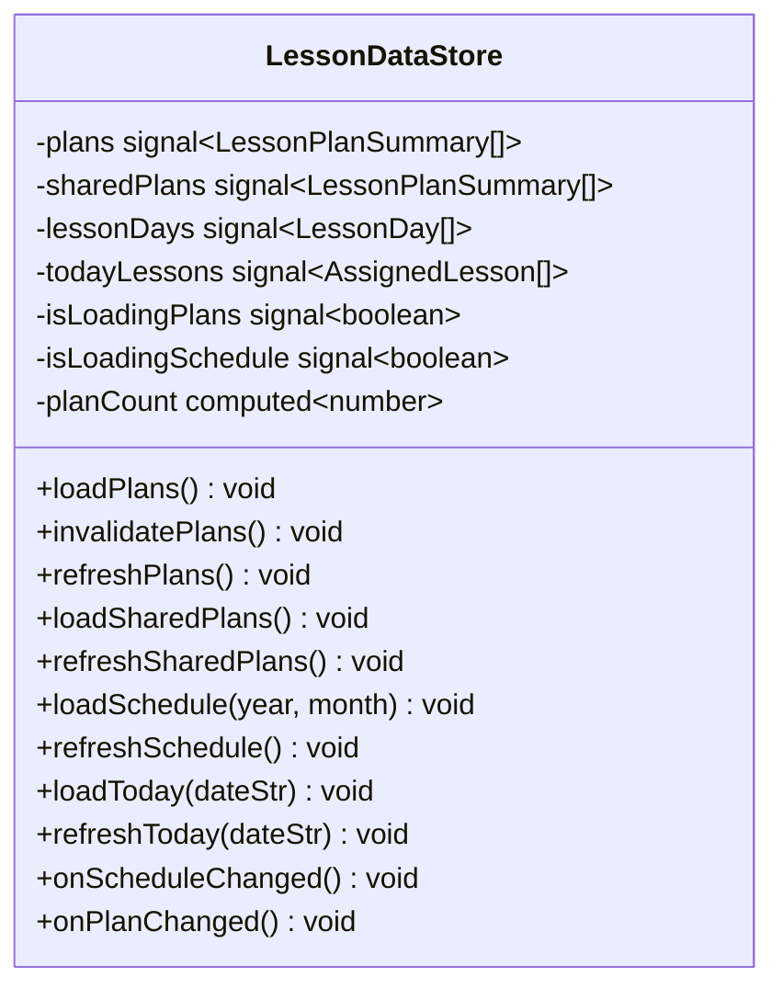
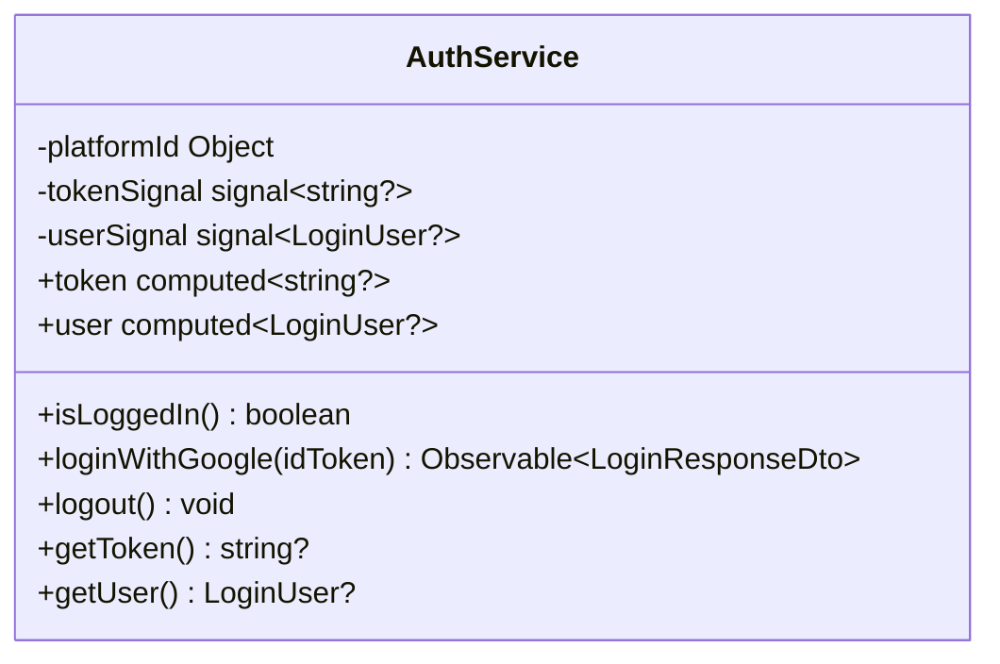

# Frontend — 04 Services

8 HTTP-facing services + 1 in-memory state store ([LessonDataStore](../../lessonshub-ui/src/app/services/lesson-data.store.ts)).

> **Source files**: [lessonshub-ui/src/app/services/](../../lessonshub-ui/src/app/services/).

## Service → endpoint map

```mermaid
flowchart LR
  classDef svc fill:#e8f5e9
  classDef store fill:#bbdefb
  classDef api fill:#e3f2fd

  AuthSvc[AuthService]:::svc --> A1[/POST /api/auth/google/]:::api
  Profile[UserProfileService]:::svc --> P1[/GET /api/user/profile/]:::api
  Profile --> P2[/PUT /api/user/profile/]:::api
  Plan[LessonPlanService]:::svc --> LP1[/POST /api/lessonplan/generate/]:::api
  Plan --> LP2[/POST /api/lessonplan/save/]:::api
  Lesson[LessonService]:::svc --> L1[/GET /api/lesson/{id}/]:::api
  Lesson --> L2[/PUT /api/lesson/{id}/]:::api
  Lesson --> L3[/POST /api/lesson/{id}/regenerate-content/]:::api
  Lesson --> L4[/PATCH /api/lesson/{id}/complete/]:::api
  Lesson --> L5[/GET /api/lesson/{id}/siblings/]:::api
  Lesson --> L6[/POST /api/lesson/{id}/generate-exercise/]:::api
  Lesson --> L7[/POST /api/lesson/{id}/retry-exercise/]:::api
  Lesson --> L8[/POST /api/lesson/exercise/{id}/check/]:::api
  Day[LessonDayService]:::svc --> D1[/GET /api/lessonday/plans/]:::api
  Day --> D2[/GET /api/lessonplan/{id}/]:::api
  Day --> D3[/DELETE /api/lessonplan/{id}/]:::api
  Day --> D4[/PUT /api/lessonplan/{id}/]:::api
  Day --> D5[/GET /api/lessonday/{year}/{month}/]:::api
  Day --> D6[/POST /api/lessonday/assign/]:::api
  Day --> D7[/DELETE /api/lessonday/unassign/{id}/]:::api
  Day --> D8[/GET /api/lessonday/date/{date}/]:::api
  Day --> D9[/GET /api/lessonday/plans/{id}/lessons/]:::api
  Doc[DocumentService]:::svc --> D10[/GET /api/documents/]:::api
  Doc --> D11[/GET /api/documents/{id}/]:::api
  Doc --> D12[/POST /api/documents/upload/]:::api
  Doc --> D13[/DELETE /api/documents/{id}/]:::api
  Share[LessonPlanShareService]:::svc --> S1[/GET /api/lessonplan/shared-with-me/]:::api
  Share --> S2[/GET /api/lessonplan/{id}/shares/]:::api
  Share --> S3[/POST /api/lessonplan/{id}/shares/]:::api
  Share --> S4[/DELETE /api/lessonplan/{id}/shares/{userId}/]:::api
  Notify[NotificationService]:::svc

  Store[LessonDataStore]:::store --> Day
  Store --> Share
```

## `LessonDataStore`

The cross-component cache. Owns four signals and provides cache-aware loaders.



`loadX` checks the signal — if already populated and not stale, it's a no-op. `refreshX` is the explicit "I just mutated something, fetch again" call. The mutators (`onScheduleChanged`, `onPlanChanged`) reset the relevant signals so the next `loadX` call re-fetches.

## Per-service class summaries

### `AuthService` ([services/auth.service.ts](../../lessonshub-ui/src/app/services/auth.service.ts))



`isLoggedIn()` decodes the JWT, checks `exp`, and returns false if expired. SSR-aware: returns `false` when running on the server (no `localStorage`).

### `LessonPlanService` ([services/lesson-plan.service.ts](../../lessonshub-ui/src/app/services/lesson-plan.service.ts))

```typescript
class LessonPlanService {
  generateLessonPlan(request: LessonPlanRequest): Observable<LessonPlanResponse>
  saveLessonPlan(
    plan, description, lessonType,
    nativeLanguage?, documentId?, languageToLearn?, useNativeLanguage?
  ): Observable<any>
}
```

The save signature carries the trio of language fields so the component can send only the relevant ones (Language → all three, Default/Technical → just `nativeLanguage`).

### `LessonService` ([services/lesson.service.ts](../../lessonshub-ui/src/app/services/lesson.service.ts))

```typescript
class LessonService {
  getLessonById(id): Observable<Lesson>
  generateExercise(id, difficulty, comment?): Observable<Exercise>
  retryExercise(id, difficulty, comment?, review): Observable<Exercise>
  submitExerciseAnswer(exerciseId, answer): Observable<ExerciseAnswer>
  updateLesson(id, info: UpdateLessonInfo): Observable<Lesson>
  regenerateContent(id, bypassDocCache): Observable<Lesson>
  completeLesson(id): Observable<Lesson>
  getSiblingLessonIds(id): Observable<SiblingLessons>
}
```

### `LessonDayService` ([services/lesson-day.service.ts](../../lessonshub-ui/src/app/services/lesson-day.service.ts))

```typescript
class LessonDayService {
  getLessonPlans(): Observable<LessonPlanSummary[]>
  getLessonPlanDetail(id): Observable<LessonPlanDetail>
  deleteLessonPlan(id): Observable<void>
  updateLessonPlan(id, request: UpdateLessonPlanRequest): Observable<LessonPlanDetail>
  getAvailableLessons(planId): Observable<AvailableLesson[]>
  getLessonDaysByMonth(year, month): Observable<LessonDay[]>
  assignLesson(request: AssignLessonRequest): Observable<void>
  unassignLesson(lessonId): Observable<void>
  getLessonDayByDate(date): Observable<LessonDay?>
}
```

### `DocumentService` ([services/document.service.ts](../../lessonshub-ui/src/app/services/document.service.ts))

```typescript
class DocumentService {
  list(): Observable<Document[]>
  get(id): Observable<Document>
  upload(file: File): Observable<UploadProgress>  // emits {progress: 0-100} or {document: Document}
  delete(id): Observable<void>
}
```

`upload` returns `Observable<UploadProgress>` instead of `Observable<Document>` because it surfaces `HttpEventType.UploadProgress` events for the progress bar.

### `LessonPlanShareService` ([services/lesson-plan-share.service.ts](../../lessonshub-ui/src/app/services/lesson-plan-share.service.ts))

```typescript
class LessonPlanShareService {
  getSharedWithMe(): Observable<LessonPlanSummary[]>
  getShares(planId): Observable<LessonPlanShareItem[]>
  addShare(planId, request: AddShareRequest): Observable<LessonPlanShareItem>
  removeShare(planId, userId): Observable<void>
}
```

### `UserProfileService` ([services/user-profile.service.ts](../../lessonshub-ui/src/app/services/user-profile.service.ts))

```typescript
class UserProfileService {
  getProfile(): Observable<UserProfile>
  updateProfile(request: UpdateUserProfileRequest): Observable<UserProfile>
}
```

### `NotificationService` ([services/notification.service.ts](../../lessonshub-ui/src/app/services/notification.service.ts))

Local-state only — emits toasts that the root `App` component renders. No HTTP.

```typescript
class NotificationService {
  success(message: string): void  // auto-dismiss 4s
  error(message: string): void    // auto-dismiss 6s
  clear(): void
  current = signal<Notification | null>(null);
}
```

## Service injection patterns

All services are `@Injectable({ providedIn: 'root' })` — single shared instance per app.

Components inject via the constructor or `inject()`:

```typescript
constructor(private lessonPlanService: LessonPlanService) {}
// or
private docs = inject(DocumentService);
```

Modern code prefers `inject()` (used in functional guards + standalone components), but constructor injection still works fine for class components.

## Error handling pattern

Components subscribe with `next` + `error` callbacks. The error path typically:

1. Sets a local `error` signal to display in the template.
2. Calls `notify.error('user-friendly message: ' + (err.error?.message || err.message))`.
3. Resets any loading signals.

There's no global error interceptor — errors surface where the call originated.
