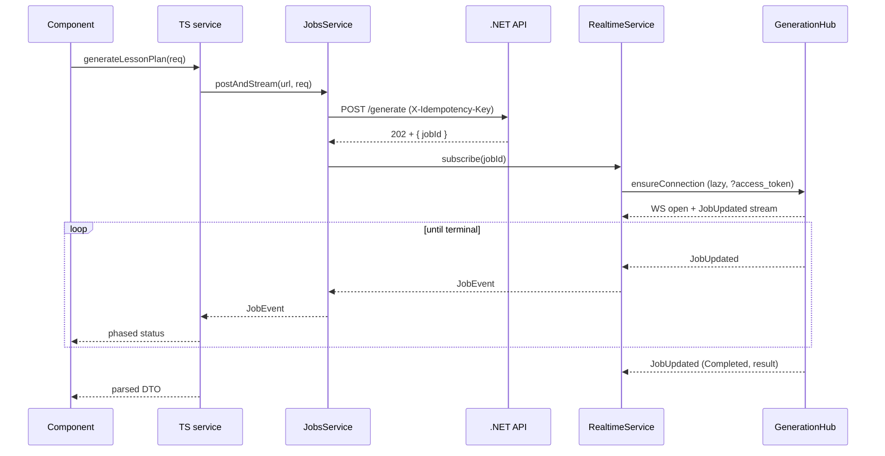

# Frontend — 04 Services

10 services + 1 in-memory state store ([LessonDataStore](../../lessonshub-ui/src/app/services/lesson-data.store.ts)). Most are HTTP-facing; [RealtimeService](../../lessonshub-ui/src/app/services/realtime.service.ts) owns the SignalR connection, and [JobsService](../../lessonshub-ui/src/app/services/jobs.service.ts) is the central client for `/api/jobs/*` — every async-generation endpoint goes through it.

> **Source files**: [lessonshub-ui/src/app/services/](../../lessonshub-ui/src/app/services/).

## SignalR job pipeline

All AI-generation calls are async. The browser POSTs, gets `202 + jobId`, subscribes to the hub, then renders progress + final result as `JobEvent`s arrive. `JobsService.postAndStream` collapses POST + subscribe + filter on terminal status + throw on failure into one call so each AI-facing service method stays at ~3 lines.

`JobStatus.Failed` causes the observable to error with the server's message. JWT is forwarded on the WS handshake via `accessTokenFactory: () => this.auth.getToken()` (key in `localStorage` is `auth_token`); the .NET side accepts `?access_token=…` only on `/hubs/*` paths.

### `JobsService` API

| Method | Purpose |
| --- | --- |
| `postAndStream<TBody>(url, body, opts?)` | The standard "fire-and-forget then stream" entry point. Auto-injects `X-Idempotency-Key`. Returns `Observable<JobEvent>`. |
| `subscribeToExistingJob(jobId)` | Resume tracking by id. Polls `GET /api/jobs/{id}` first to handle the race where the executor finished between page load and the WS handshake. |
| `findInFlight(type, entityType?, entityId?)` | Single-job page-load probe. Returns the matching `JobDto` or `null`. |
| `listInFlightForEntity(entityType, entityId)` | All jobs the user has on one entity — one query lets a detail page repaint every active banner. |
| `get(jobId)` | Polling fallback (used internally). |

### In-flight recovery on revisit

- **Lesson plan generate**: `LessonPlan.ngOnInit` calls `findInFlight('LessonPlanGenerate')`. If the job already completed while the user was away, the result is also persisted to `localStorage['lessonshub:pendingPlan']` (24h TTL) so the form repopulates without re-paying for generation.
- **Lesson detail**: `LessonDetail.loadLesson` calls `listInFlightForEntity('Lesson', id)` and dispatches each returned job to the matching banner.
- **Other endpoints**: exercise review and document ingest don't restore banners on revisit — page reload shows new state.

Subscription cleanup uses `takeUntilDestroyed(this.destroyRef)` to prevent leaks across component re-creation.

## Service → endpoint summary

| Service | Owns |
| --- | --- |
| `AuthService` | `POST /api/auth/google`, JWT lifecycle, `isLoggedIn()` decoding |
| `UserProfileService` | `GET/PUT /api/user/profile` |
| `LessonPlanService` | Generate (async) + save plan |
| `LessonService` | Lesson read/edit/regen + exercise generate/retry/check |
| `LessonDayService` | Calendar, plan list, available lessons, assign/unassign |
| `LessonPlanShareService` | Share CRUD + shared-with-me list |
| `DocumentService` | Upload (with progress events), list/get/delete |
| `JobsService` | The job pipeline central helper (described above) |
| `RealtimeService` | Lazy SignalR `HubConnection`, multiplexes `JobUpdated` to per-jobId subjects |
| `NotificationService` | Local-state only — toasts + bell-icon notification history (20-item cap, unread badge) |

## `LessonDataStore`

Cross-component cache. Owns four signals (`plans`, `sharedPlans`, `lessonDays`, `todayLessons`) plus loading flags. `loadX` is cache-aware (no-op if populated); `refreshX` forces a re-fetch. Mutator hooks (`onPlanChanged`, `onScheduleChanged`) reset the relevant signals so the next `loadX` call re-fetches.

## Patterns

- **Injection**: all services are `@Injectable({ providedIn: 'root' })`. Modern code prefers `inject()` (used in functional guards + standalone components); constructor injection still works for class components.
- **Error handling**: components subscribe with `next` + `error` callbacks. The error path sets a local `error` signal, calls `notify.error(...)`, and resets loading signals. There's no global error interceptor — errors surface where the call originated.
- **`AuthService.isLoggedIn()`** decodes the JWT, checks `exp`, and returns `false` if expired. SSR-aware: returns `false` when running on the server.
- **`DocumentService.upload`** returns `Observable<UploadProgress>` rather than `Observable<Document>` because it surfaces `HttpEventType.UploadProgress` events for the progress bar.
