# Frontend — 05 Models

TypeScript interfaces under [lessonshub-ui/src/app/models/](../../lessonshub-ui/src/app/models/). They mirror the .NET DTOs in shape; field names use camelCase per the .NET API's serialization config.

## Class diagram

```mermaid
classDiagram
  class LessonPlanRequest {
    +string lessonType
    +string planName
    +number? numberOfDays
    +string topic
    +string description
    +string? nativeLanguage
    +string? languageToLearn
    +boolean? useNativeLanguage
    +boolean? bypassDocCache
    +number? documentId
  }

  class LessonPlanResponse {
    +string planName
    +string topic
    +GeneratedLesson[] lessons
  }

  class GeneratedLesson {
    +number lessonNumber
    +string name
    +string shortDescription
    +string topic
    +string? lessonTopic
    +string[]? keyPoints
  }

  class LessonPlanSummary {
    +number id
    +string name
    +string topic
    +string description
    +string createdDate
    +number lessonsCount
    +boolean isOwner
    +string? ownerName
  }

  class LessonPlanDetail {
    +number id
    +string name
    +string topic
    +string description
    +string? nativeLanguage
    +string? languageToLearn
    +boolean? useNativeLanguage
    +string createdDate
    +PlanLesson[] lessons
    +boolean isOwner
    +string? ownerName
  }

  class PlanLesson {
    +number id
    +number lessonNumber
    +string name
    +string shortDescription
    +string lessonTopic
    +boolean isCompleted
  }

  class UpdateLessonPlanRequest {
    +string name
    +string topic
    +string description
    +string? nativeLanguage
    +string? languageToLearn
    +boolean? useNativeLanguage
    +UpdateLessonRequest[] lessons
  }

  class UpdateLessonRequest {
    +number? id
    +number lessonNumber
    +string name
    +string shortDescription
    +string lessonTopic
    +string[] keyPoints
  }

  class LessonPlanShareItem {
    +number id
    +number userId
    +string email
    +string name
    +string sharedAt
  }

  class AddShareRequest {
    +string email
  }

  class LessonDay {
    +number id
    +string date
    +string name
    +string shortDescription
    +AssignedLesson[] lessons
  }

  class AssignedLesson {
    +number id
    +number lessonNumber
    +string name
    +string shortDescription
    +number lessonPlanId
    +string lessonPlanName
    +boolean isCompleted
  }

  class AvailableLesson {
    +number id
    +number lessonNumber
    +string name
    +string shortDescription
    +number lessonPlanId
    +string lessonPlanName
    +boolean isAssigned
  }

  class AssignLessonRequest {
    +number lessonId
    +string date
    +string dayName
    +string dayDescription
  }

  class Lesson {
    +number id
    +number lessonNumber
    +string name
    +string shortDescription
    +string content
    +string lessonType
    +string lessonTopic
    +string[] keyPoints
    +boolean isCompleted
    +string? completedAt
    +number lessonPlanId
    +number? lessonDayId
    +Exercise[] exercises
    +ChatMessage[] chatHistory
    +Video[] videos
    +Book[] books
    +Documentation[] documentation
    +boolean isOwner
    +string? ownerName
  }

  class Exercise {
    +number id
    +string exerciseText
    +string difficulty
    +number lessonId
    +ExerciseAnswer[] answers
    +ChatMessage[] chatHistory
  }

  class ExerciseAnswer {
    +number id
    +string userResponse
    +string submittedAt
    +number? accuracyLevel
    +string? reviewText
    +number exerciseId
  }

  class Video {
    +number id
    +string title
    +string channel
    +string description
    +string url
    +number lessonId
  }

  class Book {
    +number id
    +string author
    +string bookName
    +number? chapterNumber
    +string? chapterName
    +string description
    +number lessonId
  }

  class Documentation {
    +number id
    +string name
    +string? section
    +string description
    +string url
    +number lessonId
  }

  class ChatMessage {
    +number id
    +string role
    +string text
    +string createdAt
  }

  class UpdateLessonInfo {
    +string name
    +string shortDescription
    +string lessonTopic
    +string[] keyPoints
  }

  class Document {
    +number id
    +string name
    +string contentType
    +number sizeBytes
    +IngestionStatus ingestionStatus
    +string? ingestionError
    +number? chunkCount
    +string createdAt
    +string? ingestedAt
  }

  class IngestionStatus {
    <<enum>>
    Pending
    Ingested
    Failed
  }

  LessonPlanResponse --> GeneratedLesson
  LessonPlanDetail --> PlanLesson
  UpdateLessonPlanRequest --> UpdateLessonRequest
  LessonDay --> AssignedLesson
  Lesson --> Exercise
  Lesson --> Video
  Lesson --> Book
  Lesson --> Documentation
  Lesson --> ChatMessage
  Exercise --> ExerciseAnswer
  Exercise --> ChatMessage
  Document --> IngestionStatus
```

## Per-file inventory

### [lesson-plan.model.ts](../../lessonshub-ui/src/app/models/lesson-plan.model.ts)

The plan-generation flow's contract.

- `LessonPlanRequest` — what the form submits.
- `GeneratedLesson` — one lesson in a generated plan (transient, not yet saved).
- `LessonPlanResponse` — what `/api/lessonplan/generate` returns.
- `LESSON_TYPES` — the const array `['Technical', 'Language', 'Default']`.

Notable: `useNativeLanguage` and `languageToLearn` are optional on the request — components only set them when `lessonType === 'Language'`.

### [lesson.model.ts](../../lessonshub-ui/src/app/models/lesson.model.ts)

The lesson-detail page's domain.

- `Lesson` — full lesson with embedded exercises, chat, resources.
- `Exercise`, `ExerciseAnswer`, `ChatMessage` — exercise lifecycle.
- `Video`, `Book`, `Documentation` — researcher-agent output.
- `UpdateLessonInfo` — the partial used by the inline lesson editor.
- `DIFFICULTIES = ['Easy', 'Average', 'Hard', 'Very hard']` — exercise dialog dropdown.

`Lesson.isOwner` drives the permission UI: owner-only buttons (regenerate, edit, complete) are gated on it.

### [lesson-day.model.ts](../../lessonshub-ui/src/app/models/lesson-day.model.ts)

The calendar / scheduler page's domain.

- `LessonDay`, `AssignedLesson`, `AvailableLesson` — shapes the day picker UI uses.
- `LessonPlanSummary` — list-page summary card.
- `LessonPlanDetail` — full plan editor data, including the language trio.
- `LessonPlanShareItem`, `AddShareRequest` — sharing.
- `UpdateLessonPlanRequest`, `UpdateLessonRequest` — what `PUT /api/lessonplan/{id}` accepts.
- `AssignLessonRequest` — what `POST /api/lessonday/assign` accepts.
- `PlanLesson` — single lesson row inside a `LessonPlanDetail`.

### [document.model.ts](../../lessonshub-ui/src/app/models/document.model.ts)

- `Document` — the user-uploaded file row.
- `IngestionStatus` enum — `'Pending' | 'Ingested' | 'Failed'`.

## Naming conventions

- Interface fields use **camelCase**, matching the JSON over the wire (the .NET API serializes with the camelCase contract resolver).
- Date fields are **strings** (ISO 8601 from the server). Component code parses them with `new Date(...)` only when display formatting is needed.
- Optional fields use `?:` not `| undefined` — keeps the call sites cleaner.
- Enum-like sets (`LESSON_TYPES`, `DIFFICULTIES`) are exported as `const` arrays, not TS enums, to avoid the runtime overhead.

## What's NOT modeled

- `User` — the UI doesn't have a full user model; it only deals with `LoginUser` (`{ id, email, name, pictureUrl }`) returned by login, plus `UserProfile` (`{ email, name, googleApiKey, pictureUrl }`) on the profile page.
- `AiRequestLog` — purely server-side observability; no UI surface.
- `Document.UserId`, `Lesson.UserId` etc. — not exposed; the API filters by current user.
