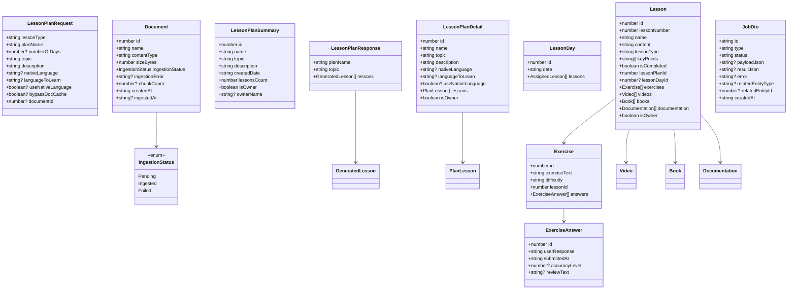

# Frontend — 05 Models

TypeScript interfaces under [lessonshub-ui/src/app/models/](../../lessonshub-ui/src/app/models/). Field names use camelCase matching the .NET API's serializer; date fields are ISO 8601 strings.

## Class diagram

## Per-file inventory

- [lesson-plan.model.ts](../../lessonshub-ui/src/app/models/lesson-plan.model.ts) — `LessonPlanRequest`, `LessonPlanResponse`, `GeneratedLesson`, plus `LESSON_TYPES = ['Technical', 'Language', 'Default']`.
- [lesson.model.ts](../../lessonshub-ui/src/app/models/lesson.model.ts) — `Lesson`, `Exercise`, `ExerciseAnswer`, `Video`, `Book`, `Documentation`, `ChatMessage`, `UpdateLessonInfo`, plus `DIFFICULTIES = ['Easy', 'Average', 'Hard', 'Very hard']`.
- [lesson-day.model.ts](../../lessonshub-ui/src/app/models/lesson-day.model.ts) — `LessonDay`, `AssignedLesson`, `AvailableLesson`, `LessonPlanSummary`, `LessonPlanDetail`, `LessonPlanShareItem`, `AddShareRequest`, `UpdateLessonPlanRequest`, `UpdateLessonRequest`, `AssignLessonRequest`, `PlanLesson`.
- [document.model.ts](../../lessonshub-ui/src/app/models/document.model.ts) — `Document`, `IngestionStatus` enum.
- [job.model.ts](../../lessonshub-ui/src/app/models/job.model.ts) — `JobDto`, `JobEvent`, `JobStatus` enum (mirrors the .NET enum).

## Conventions

- Interface fields are **camelCase**, matching the JSON wire format.
- Date fields are **strings** (ISO 8601 from the server). Components parse them with `new Date(...)` only for display formatting.
- Optional fields use `?:` not `| undefined` — keeps call sites cleaner.
- Enum-like sets (`LESSON_TYPES`, `DIFFICULTIES`) are exported as `const` arrays, not TS enums, to avoid runtime overhead. Real enums are reserved for value sets that flow over the wire (`IngestionStatus`, `JobStatus`).
- `Lesson.isOwner` and `LessonPlanDetail.isOwner` drive the permission UI: owner-only buttons (regenerate, edit, complete, share, delete) are gated on these.
