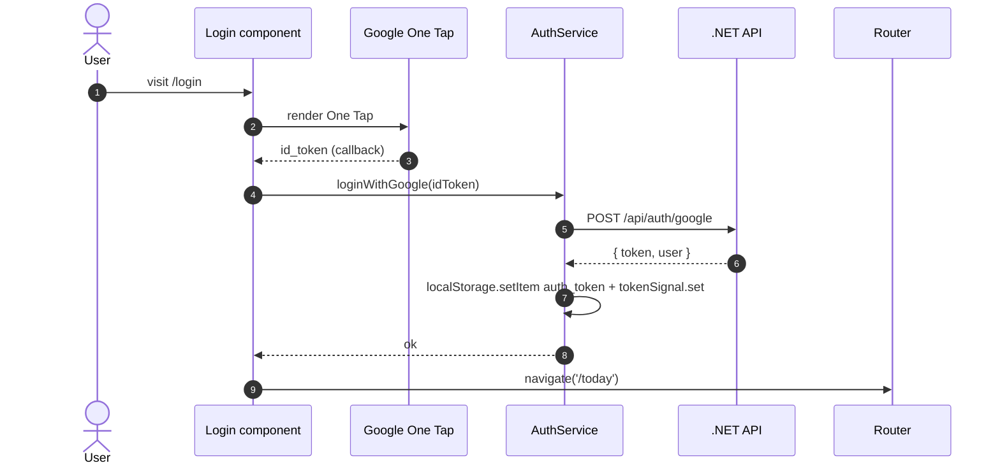
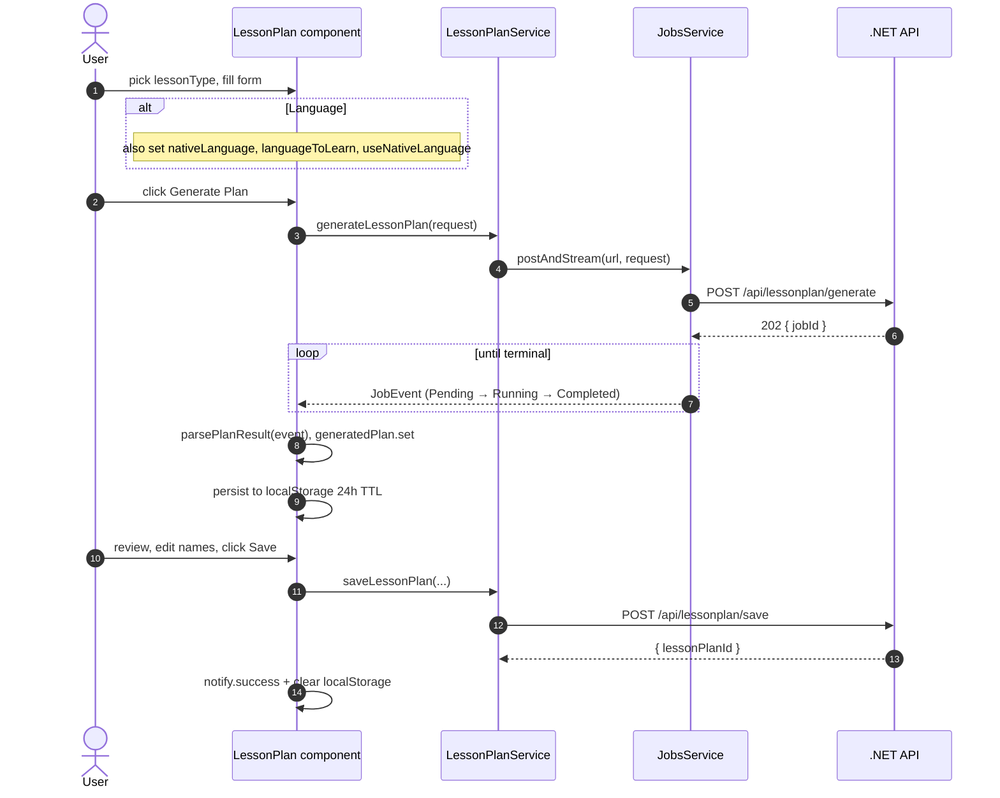
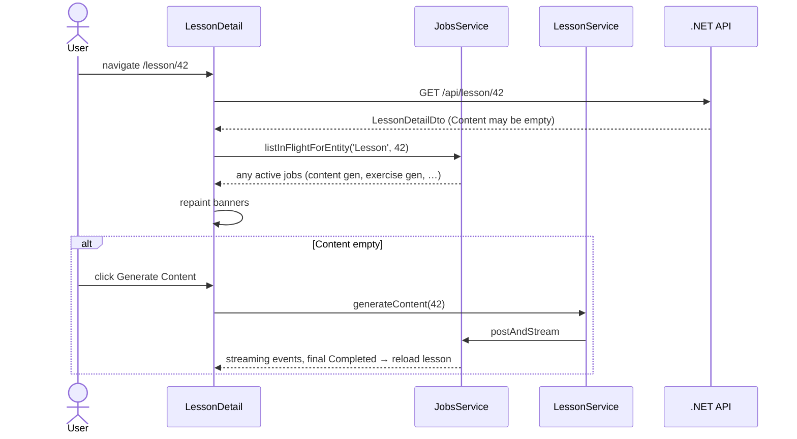
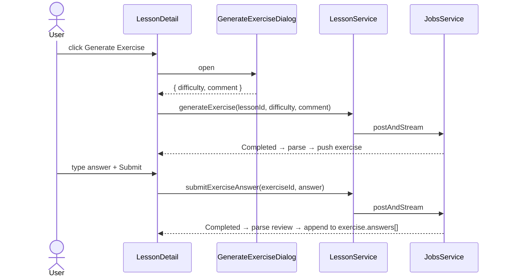
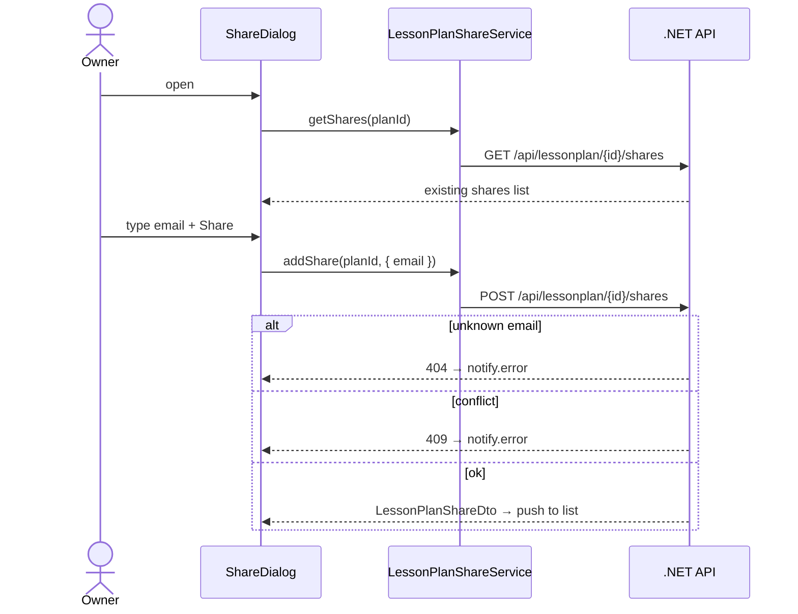
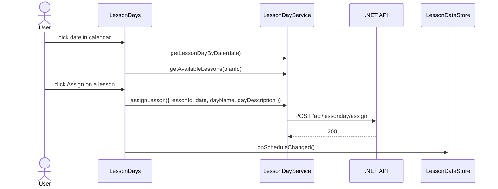
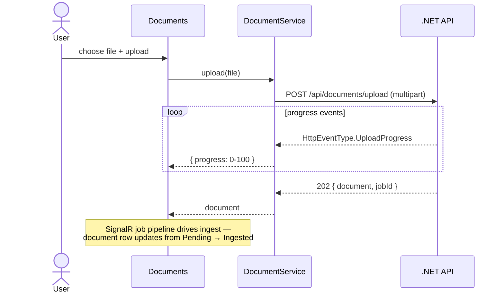

# Frontend — 06 Flows

Component-level user flows. AI-orchestrated detail (what happens *inside* a `generate` call once it leaves the UI) is in [../ai/03-services-and-crews.md](../ai/03-services-and-crews.md) and [../backend/06-flows.md](../backend/06-flows.md).

## Login (Google One Tap)

## Generate + save a lesson plan

The localStorage backup means the user can navigate away and return without re-paying for generation. On revisit, `LessonPlan.ngOnInit` calls `JobsService.findInFlight('LessonPlanGenerate')` to resume an in-flight job, or reads `localStorage['lessonshub:pendingPlan']` for an already-completed-but-unsaved one.

## Lesson detail + content generation

Sibling navigation (`prev`/`next`) subscribes to `route.paramMap` so the URL change reloads without a full re-render.

## Generate exercise + submit answer

Exercises are tagged server-side with the *caller's* `userId` — borrowers (people the plan was shared with) get their own exercises, not the owner's.

## Share a plan

## Schedule a lesson

## Upload a document

If ingestion fails, the document still appears in the list with `status: "Failed"` and an `ingestionError` — the user can re-upload.
