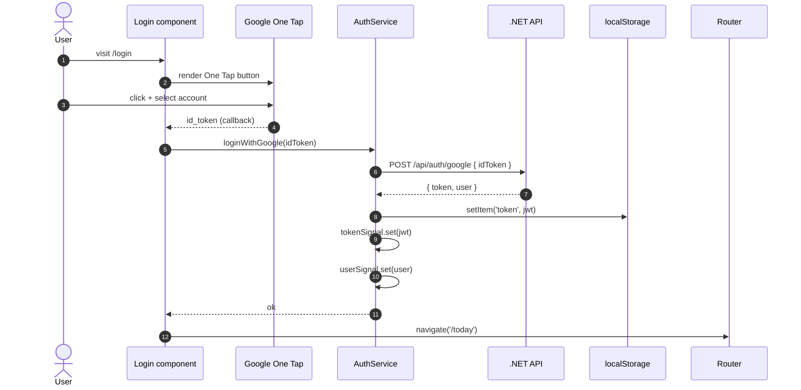
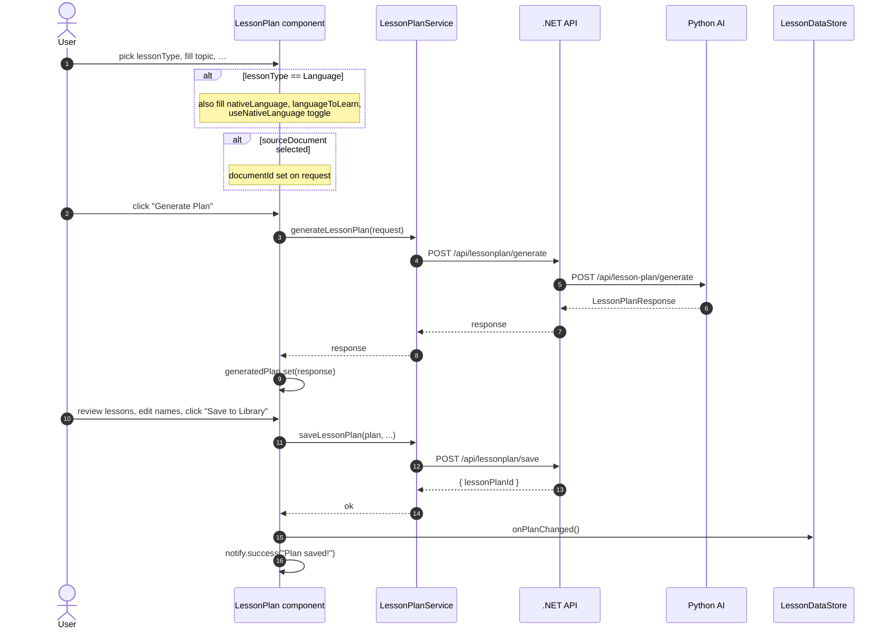
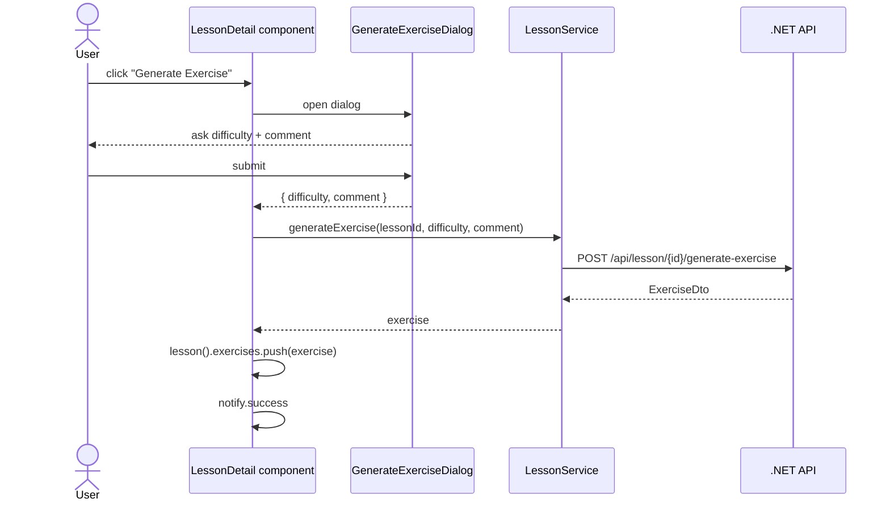
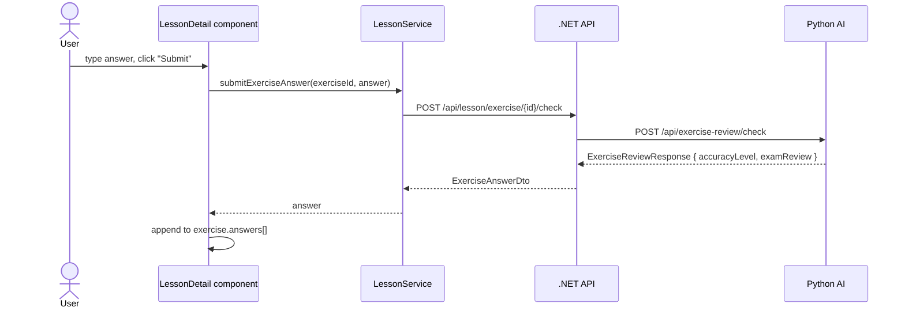
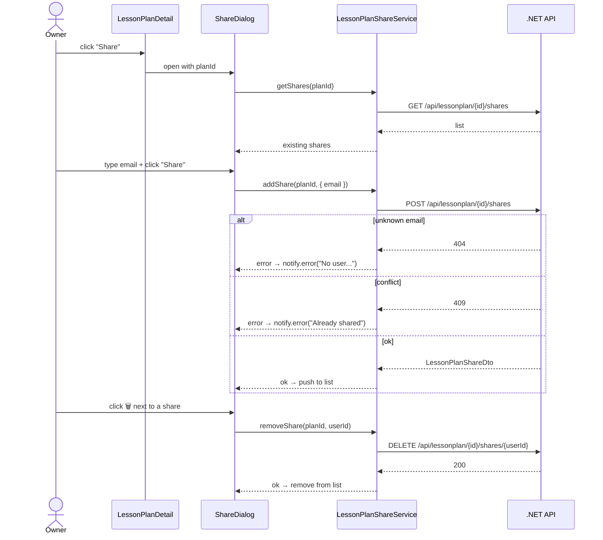

# Frontend — 06 Flows

Component-level user flows. AI-orchestrated flows (what happens *inside* a `generate` call once it leaves the UI) are in [../flows/](../flows/).

## Login (Google One Tap)



## Generate + save a lesson plan



The component calls `Store.onPlanChanged()` so the next visit to `/lesson-plans` re-fetches.

## Generate exercise (any user, plan-shared OK)



The exercise is tagged server-side with the *caller's* `userId` — borrowers (people the plan was shared with) get their own exercise, not the owner's.

## Submit answer + receive review



The review is rendered as markdown beneath the user's answer.

## Regenerate lesson content (owner-only)

```mermaid
sequenceDiagram
  actor Owner
  participant LD as LessonDetail
  participant Dlg as RegenerateLessonDialog
  participant LS as LessonService
  participant API as .NET API
  participant AI as Python AI

  Owner->>LD: click "Regenerate" (visible only if isOwner)
  LD->>Dlg: open
  Dlg-->>Owner: ask bypassDocCache + comment
  Owner->>Dlg: submit
  Dlg-->>LD: { bypassDocCache, comment }
  LD->>LS: regenerateContent(id, bypassDocCache)
  LS->>API: POST /api/lesson/{id}/regenerate-content?bypassDocCache=true
  API->>AI: POST /api/lesson-content/generate
  AI-->>API: new content
  API->>API: lesson.Content = content; SaveChanges
  API-->>LS: updated LessonDetailDto
  LS-->>LD: lesson
  LD->>LD: lesson.set(updated)
```

## Share a plan



## Schedule a lesson on a date

```mermaid
sequenceDiagram
  actor User
  participant LDays as LessonDays
  participant LDS as LessonDayService
  participant API as .NET API
  participant Store as LessonDataStore

  User->>LDays: pick date in calendar
  LDays->>LDS: getLessonDayByDate(date)
  LDS->>API: GET /api/lessonday/date/{date}
  API-->>LDS: LessonDayDto?
  LDS-->>LDays: existing day or null
  User->>LDays: pick a plan
  LDays->>LDS: getAvailableLessons(planId)
  LDS->>API: GET /api/lessonday/plans/{id}/lessons
  API-->>LDS: AvailableLesson[]
  LDS-->>LDays: lessons (with isAssigned flag)
  User->>LDays: click "Assign" on a lesson
  LDays->>LDS: assignLesson({ lessonId, date, dayName, dayDescription })
  LDS->>API: POST /api/lessonday/assign
  API->>API: upsert LessonDay; set lesson.LessonDayId
  API-->>LDS: 200
  LDS-->>LDays: ok
  LDays->>Store: onScheduleChanged()
```

## Upload a document

```mermaid
sequenceDiagram
  actor User
  participant Docs as Documents component
  participant DS as DocumentService
  participant API as .NET API
  participant AI as Python AI (RAG)

  User->>Docs: choose file, click upload
  Docs->>DS: upload(file)
  DS->>API: POST /api/documents/upload (multipart, with progress)
  API-->>DS: HttpEventType.UploadProgress (multiple)
  loop while progress events
    DS-->>Docs: { progress: 0-100 }
    Docs->>Docs: uploadProgress.set(n)
  end
  API->>API: write to GCS / local FS
  API->>AI: POST /api/rag/ingest
  AI->>AI: chunk + embed + upsert to pgvector
  AI-->>API: { chunkCount }
  API-->>DS: HttpEventType.Response { document with status: "Ingested" }
  DS-->>Docs: { document }
  Docs->>Docs: documents().push(document); isUploading.set(false)
  Docs->>Docs: notify.success
```

If the AI ingestion fails, the document still appears in the list with `status: "Failed"` and an `ingestionError` — the user can re-upload.

## Update profile (Gemini API key)

```mermaid
sequenceDiagram
  actor User
  participant Pr as Profile component
  participant UPS as UserProfileService
  participant API as .NET API

  User->>Pr: paste Gemini API key, click Save
  Pr->>UPS: updateProfile({ googleApiKey })
  UPS->>API: PUT /api/user/profile
  API->>API: Update User.GoogleApiKey; SaveChanges
  API-->>UPS: UserProfileDto
  UPS-->>Pr: profile
  Pr->>Pr: notify.success
```

After this, every AI call routed through `IUserApiKeyProvider` uses the new key.
