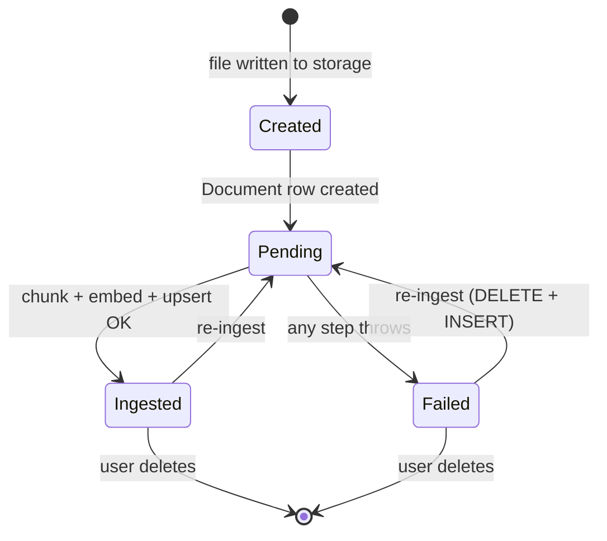
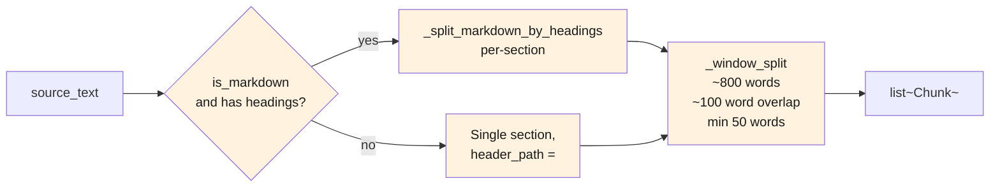
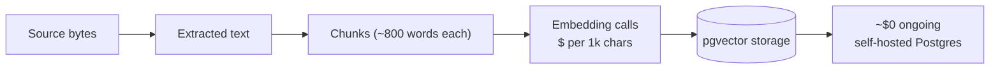

# RAG — Ingest

User uploads a document via the UI → .NET stores the file in GCS/local → calls Python `/api/rag/ingest` → Python reads + extracts + chunks + embeds + upserts into pgvector. Idempotent: re-ingesting the same `documentId` replaces all its chunks.

> **Source files**: [LessonsHub/Controllers/DocumentsController.cs](../../LessonsHub/Controllers/DocumentsController.cs), [LessonsHub.Application/Services/DocumentService.cs](../../LessonsHub.Application/Services/DocumentService.cs), [routes/rag.py:rag_ingest](../../lessons-ai-api/routes/rag.py), [tools/doc_storage.py](../../lessons-ai-api/tools/doc_storage.py), [tools/rag_chunker.py](../../lessons-ai-api/tools/rag_chunker.py), [tools/rag_extractors.py](../../lessons-ai-api/tools/rag_extractors.py), [tools/rag_embedder.py](../../lessons-ai-api/tools/rag_embedder.py), [tools/rag_store.py](../../lessons-ai-api/tools/rag_store.py).

## End-to-end

```mermaid
sequenceDiagram
  autonumber
  actor User
  participant UI as Angular
  participant DC as DocumentsController
  participant DS as DocumentService (.NET)
  participant DR as IDocumentRepository
  participant Storage as IDocumentStorage<br/>(Local/Gcs)
  participant RAG as IRagApiClient
  participant Route as routes/rag.py
  participant DocStore as tools/doc_storage
  participant Chunker as tools/rag_chunker
  participant Embed as tools/rag_embedder
  participant Store as tools/rag_store
  participant FS as GCS / local FS
  participant PG as Postgres pgvector

  User->>UI: upload PDF/EPUB/MD
  UI->>DC: POST /api/documents/upload (multipart)
  DC->>DS: UploadAsync(input)
  Note over DS: Validate ≤ 32 MB
  DS->>DR: Add(Document { Status="Pending", StorageUri="" })
  DS->>DR: SaveChangesAsync (gets Id)
  DS->>Storage: SaveAsync(userId, docId, fileName, stream, contentType)
  alt prod
    Storage->>FS: write to gs://&lt;project&gt;-documents/&lt;userId&gt;/&lt;docId&gt;/&lt;name&gt;
  else local-dev
    Storage->>FS: write to ./uploads/{userId}/{docId}/{name}
  end
  Storage-->>DS: storageUri
  DS->>DR: doc.StorageUri = storageUri; SaveChangesAsync

  DS->>RAG: IngestAsync(docId, storageUri, isMarkdown, apiKey)
  RAG->>Route: POST /api/rag/ingest
  Route->>DocStore: read_document(storageUri)
  DocStore->>FS: read bytes (gs:// or file://)
  FS-->>DocStore: bytes
  DocStore->>DocStore: pick extractor by extension<br/>(.pdf → pypdf, .docx → python-docx, .epub → ebooklib, else utf-8)
  DocStore-->>Route: source_text

  Route->>Chunker: chunk_text(source_text, is_markdown)
  Chunker->>Chunker: split on headings (if markdown)<br/>+ window split (~800 words, ~100 overlap)
  Chunker-->>Route: list[Chunk] (text, header_path, chunk_index)

  Route->>Embed: embed_documents(texts, api_key)
  Embed->>Embed: batch up to 100 per Gemini call
  Embed->>Embed: Gemini text-embedding-004 (RETRIEVAL_DOCUMENT)
  Embed-->>Route: returns list of vector(768) embeddings

  Route->>Store: upsert_chunks(documentId, chunks, embeddings)
  Store->>PG: BEGIN TX
  Store->>PG: DELETE WHERE DocumentId=$1
  Store->>PG: INSERT INTO DocumentChunks (DocumentId, ChunkIndex, HeaderPath, Text, Embedding) ×N
  Store->>PG: COMMIT
  Store-->>Route: chunk_count

  Route-->>RAG: { documentId, chunkCount }
  RAG-->>DS: response
  DS->>DR: doc.IngestionStatus = "Ingested"; doc.ChunkCount = N
  DS->>DR: SaveChangesAsync
  DS-->>DC: Ok(DocumentDto)
  DC-->>UI: 200 (ready)
```

## State transitions



`IngestionError` is set on `Failed` (truncated to 2000 chars). The user sees the error in the documents UI and can re-upload to retry.

## Chunking strategy



| Format | Path | Heading-aware? |
|---|---|---|
| `.md`, `.markdown` | utf-8 read | Yes (markdown headings) |
| `.txt` | utf-8 read | No (no structure) |
| `.docx` | `python-docx` extractor | Yes (Heading 1/2/3 → `#`/`##`/`###`) |
| `.epub`, `.mobi`, `.azw*` | `ebooklib` extractor | Yes (synthesizes `# Title` per chapter) |
| `.pdf` | `pypdf` extractor | No (flat text) |

When the extractor produces heading-structured markdown, each `Chunk.header_path` carries the breadcrumb (`"Chapter 1 > Section 2"`) — useful for the chunk-format step downstream.

## Why "replace" rather than "upsert"?

[rag_store.upsert_chunks](../../lessons-ai-api/tools/rag_store.py) does:

```sql
DELETE FROM DocumentChunks WHERE DocumentId = $1;
INSERT INTO DocumentChunks (DocumentId, ChunkIndex, HeaderPath, Text, Embedding) VALUES ...
```

Not a true upsert. Reason: when a user re-uploads a shorter version of a document, naive upsert would leave the old "tail" chunks orphaned (chunks 27-50 from the original would still be searchable). Delete-then-insert ensures the database reflects the current document exactly.

The whole thing runs inside a transaction so we don't end up with a half-deleted document on failure.

## Cost considerations



A 200-page book ≈ ~80k words ≈ ~100 chunks. Each chunk is one embedding call (batched into batches of 100, so 1 batched call total). At Gemini `text-embedding-004` pricing this is fractions of a cent. Storage is negligible (768 dims × 4 bytes × 100 chunks ≈ 300KB per book).

## Failure modes

- **File too large** (> 32 MB) — rejected at the .NET service before it even reaches storage.
- **Storage write fails** (GCS quota, disk full) — the .NET service rolls back the `Document` row so the user can retry without an orphaned "Pending" entry.
- **Extraction fails** — the extractor returns empty text → no chunks → `RagIngestResponse(chunkCount=0)`. The .NET service marks the document `Ingested` with 0 chunks. The user sees "0 chunks ingested" and can decide to delete + retry with a different file.
- **Embedding API rate-limited** — `_embed_batch` propagates the exception; .NET catches it and marks `Failed` with the error message. User retries.
- **DB unavailable** — `init_schema` logged a warning at startup; `upsert_chunks` raises. The `.NET` service catches and marks `Failed`. Lesson generation paths that depend on RAG continue without the document context (failing soft).
