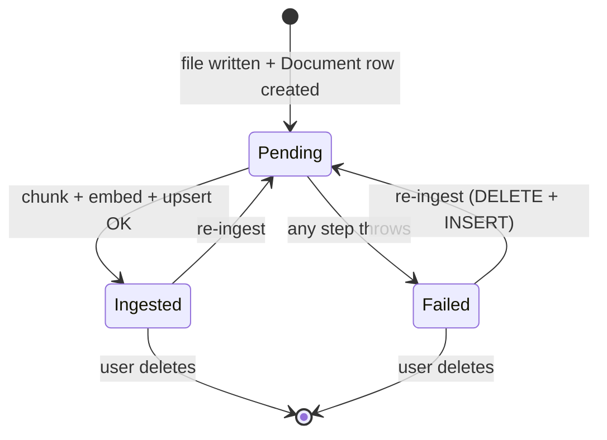

# RAG — Ingest

User uploads a document → .NET stores the file in GCS → calls Python `/api/rag/ingest` → Python reads + extracts + chunks + embeds + upserts into pgvector. Idempotent: re-ingesting the same `documentId` replaces all its chunks.

> **Source files**: [LessonsHub.Application/Services/DocumentService.cs](../../LessonsHub.Application/Services/DocumentService.cs), [routes/rag.py](../../lessons-ai-api/routes/rag.py), [tools/doc_storage.py](../../lessons-ai-api/tools/doc_storage.py), [tools/rag_chunker.py](../../lessons-ai-api/tools/rag_chunker.py), [tools/rag_extractors.py](../../lessons-ai-api/tools/rag_extractors.py), [tools/rag_embedder.py](../../lessons-ai-api/tools/rag_embedder.py), [tools/rag_store.py](../../lessons-ai-api/tools/rag_store.py).

## End-to-end

```mermaid
sequenceDiagram
  autonumber
  actor User
  participant DC as DocumentsController
  participant DS as DocumentService (.NET)
  participant Storage as IDocumentStorage
  participant Job as JobBackgroundService
  participant Route as routes/rag.py
  participant DocStore as doc_storage
  participant Chunker as rag_chunker
  participant Embed as rag_embedder
  participant Store as rag_store
  participant FS as GCS
  participant PG as Postgres pgvector

  User->>DC: POST /api/documents/upload (multipart, ≤32 MB)
  DC->>DS: UploadAsync(input)
  DS->>Storage: SaveAsync → gs://[project]-documents/[userId]/[docId]/[name]
  DS->>DC: 202 { document, jobId }

  Note over Job: DocumentIngest job
  Job->>Route: POST /api/rag/ingest
  Route->>DocStore: read_document(storageUri)
  DocStore->>FS: read bytes
  DocStore->>DocStore: extract by extension<br/>(.pdf → pypdf, .docx → python-docx,<br/>.epub → ebooklib, else utf-8)
  DocStore-->>Route: source_text

  Route->>Chunker: chunk_text(source_text, is_markdown)
  Chunker-->>Route: list[Chunk] with header_path

  Route->>Embed: embed_documents(texts, api_key)
  Embed-->>Route: vector(768) embeddings

  Route->>Store: upsert_chunks(documentId, chunks, embeddings)
  Store->>PG: BEGIN; DELETE WHERE DocumentId; INSERT × N; COMMIT
  Store-->>Route: chunk_count
  Route-->>Job: { documentId, chunkCount }
  Job->>DS: doc.IngestionStatus = "Ingested"; ChunkCount = N
```

## State transitions



`IngestionError` is set on `Failed` (truncated to 2000 chars). The user sees the error in the documents UI and can re-upload to retry.

## Chunking + extractor map

`chunk_text` splits on headings first when `is_markdown` (so each chunk gets a `header_path` like `"Chapter 1 > Section 2"`), then window-splits at ~800 words with ~100-word overlap and a 50-word minimum.

| Format | Extractor | Heading-aware? |
| --- | --- | --- |
| `.md`, `.markdown` | utf-8 read | yes |
| `.txt` | utf-8 read | no |
| `.docx` | `python-docx` | yes (Heading 1/2/3 → `#`/`##`/`###`) |
| `.epub`, `.mobi`, `.azw*` | `ebooklib` | yes (synthesizes `# Title` per chapter) |
| `.pdf` | `pypdf` | no (flat text) |

## Why "replace" rather than upsert

`upsert_chunks` is `DELETE WHERE DocumentId; INSERT × N` inside a transaction — not a true upsert. If a user re-uploads a *shorter* version of a document, naive upsert would leave the old "tail" chunks orphaned (chunks 27–50 from the original would still be searchable). Replace ensures the database reflects the current document exactly. The transaction prevents half-deleted state on failure.

## Cost

A 200-page book ≈ ~80k words ≈ ~100 chunks → 1 batched embedding call (batch size 100). At Gemini `text-embedding-004` pricing this is fractions of a cent. Storage is negligible: 768 dims × 4 bytes × 100 chunks ≈ 300 KB per book.
