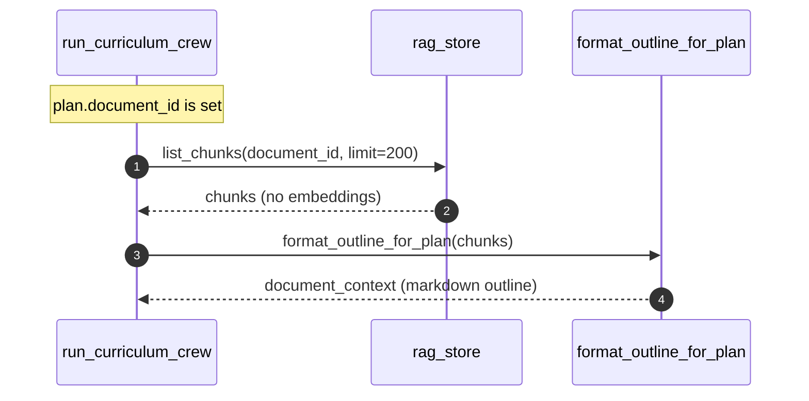
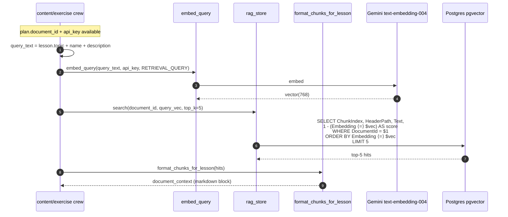

# RAG — Search

Per-lesson chunk retrieval at generation time. The Python crews call the embedder + the store directly (not the HTTP `/api/rag/search` endpoint — that endpoint is for ad-hoc external use).

> **Source files**: [routes/rag.py](../../lessons-ai-api/routes/rag.py), [tools/rag_embedder.py](../../lessons-ai-api/tools/rag_embedder.py), [tools/rag_store.py](../../lessons-ai-api/tools/rag_store.py), [tools/document_context.py](../../lessons-ai-api/tools/document_context.py), [crews/content_crew.py](../../lessons-ai-api/crews/content_crew.py), [crews/exercise_crew.py](../../lessons-ai-api/crews/exercise_crew.py), [crews/curriculum_crew.py](../../lessons-ai-api/crews/curriculum_crew.py).

## Two consumer paths

### Plan-time (curriculum crew)



The curriculum agent doesn't need every chunk's *content* — it needs the document's *structure* to design lessons that follow it. `format_outline_for_plan` extracts unique `header_path`s and renders a tree-like outline plus a one-line preview per top-level heading.

### Lesson-time (content + exercise crews)



The HNSW index on `Embedding` (with `vector_cosine_ops`) makes this query sub-millisecond even on 100k+ chunks. `top_k = settings.rag_top_k_per_lesson` (default 5) — sharp enough to stay focused, broad enough that any single passage being weak doesn't kill grounding.

## Public HTTP endpoint

`POST /api/rag/search` exposes the same logic for non-CrewAI callers (debugging/admin UI). The internal path bypasses this endpoint — direct from `embed_query` → `rag_store.search` is one fewer hop and avoids serialization.

## Why the query combines fields

The query string is `lesson.topic + lesson.name + lesson.description` so the embedding biases toward the lesson's *specific* angle. Just `"Pipes"` is ambiguous (could match Python's `pipes` module if a doc has both). `"Pipes — Lesson 5: Decorators in Angular"` embeds toward the topic in context.

## Output format

[`format_chunks_for_lesson`](../../lessons-ai-api/tools/document_context.py) renders the hits as a single markdown block:

```markdown
## Source Document — Use as Primary Source of Information

### Chapter 1 > Section 2: Pipes
{chunk text}

### Chapter 3: Decorators
{chunk text}
```

This block is included in the writer's prompt via `templates/_document_context.jinja2`. The "use as primary source" instruction tells the LLM to cite the document's claims rather than its training data.

## Fallbacks

- **Embedding API down** → `embed_query` raises; the calling crew catches and falls back to `document_context = ""` (lesson generates without RAG grounding).
- **DB unavailable** → `rag_store.search` returns `[]`; same fallback.
- **No chunks** (extractor failed at ingest) → empty result; lesson generates ungrounded.
- **Embedding model change** (`EMBEDDING_DIM` mismatch) → pgvector rejects the query with a dimension error. Solution: re-ingest all documents.
