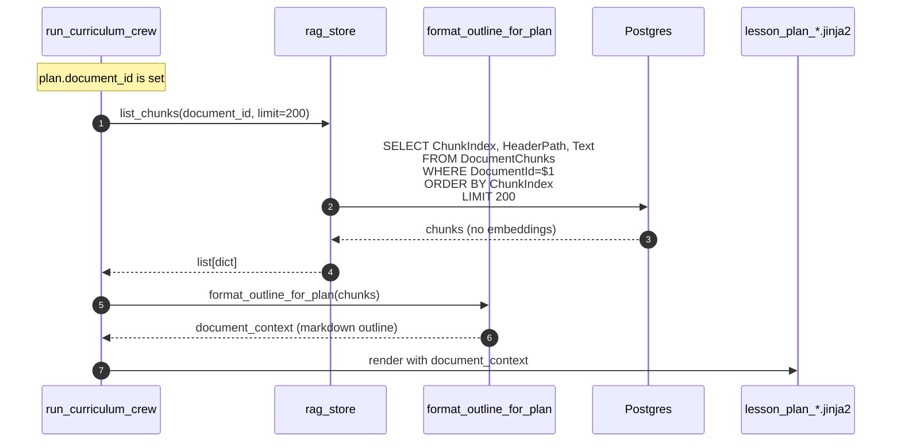
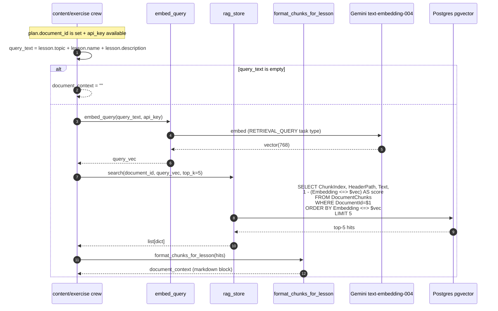
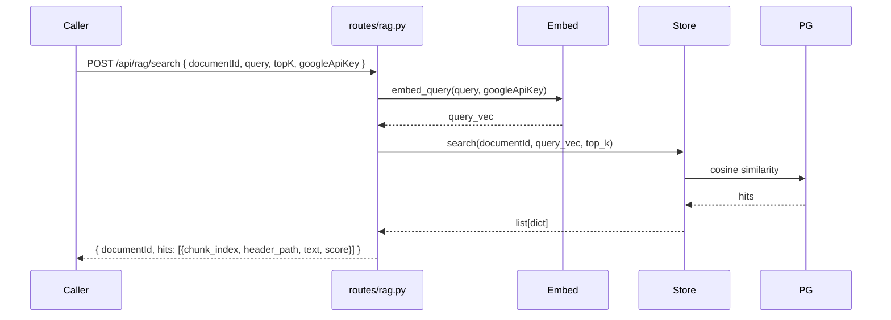
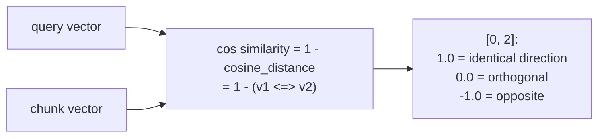
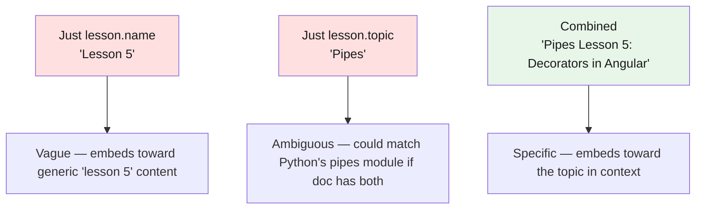

# RAG — Search

Per-lesson chunk retrieval at generation time. The Python crews call the embedder + the store directly (not the HTTP `/api/rag/search` endpoint — that endpoint is for ad-hoc external use; internal callers go through the Python helpers).

> **Source files**: [routes/rag.py:rag_search_endpoint](../../lessons-ai-api/routes/rag.py) (HTTP entry), [tools/rag_embedder.py:embed_query](../../lessons-ai-api/tools/rag_embedder.py), [tools/rag_store.py:search](../../lessons-ai-api/tools/rag_store.py), [tools/document_context.py:format_chunks_for_lesson](../../lessons-ai-api/tools/document_context.py), [crews/content_crew.py](../../lessons-ai-api/crews/content_crew.py), [crews/exercise_crew.py:_fetch_document_context](../../lessons-ai-api/crews/exercise_crew.py), [crews/curriculum_crew.py](../../lessons-ai-api/crews/curriculum_crew.py).

## Two consumer paths

### Plan-time (curriculum crew, before any lesson exists)



The curriculum agent doesn't need the *content* of every chunk — it just needs the document's *structure* to design lessons that follow it. `format_outline_for_plan` extracts unique `header_path`s and renders a tree-like outline plus a one-line preview per top-level heading.

### Lesson-time (content + exercise crews, per-lesson)



The HNSW index on `Embedding` makes this query sub-millisecond even on 100k+ chunks.

## Public HTTP endpoint

[routes/rag.py:rag_search_endpoint](../../lessons-ai-api/routes/rag.py) exposes the same logic via HTTP for non-CrewAI callers (e.g. the .NET service if it ever wanted ad-hoc retrieval, or a debugging/admin UI):



The CrewAI internal path bypasses this endpoint — going direct from `embed_query` → `rag_store.search` is one fewer hop and avoids serialization.

## Cosine similarity scoring



In practice, embeddings of related text from the same document score around 0.5–0.85. The top-5 are usually decent matches; more than 5 starts pulling in tangentially-related content.

## Why the query is `lesson.topic + lesson.name + lesson.description`



The combination biases the query vector toward chunks that match the lesson's *specific* angle. Chunks about generic "pipes" rank lower than chunks about "Angular pipes / decorators" when the query has both.

## Top-k tuning

```python
rag_top_k_per_lesson: int = 5  # in config.py
```

| `top_k` | Tradeoff |
|---|---|
| 3 | Sharp; only the most relevant chunks. May miss useful context. |
| 5 | Default; balanced. |
| 10 | Verbose; more context but more tokens. |
| 20+ | Token-heavy; LLM may lose focus. |

5 is the right default for most documents. Bump for very large books where any single passage is unlikely to be sufficient.

## Format output

[document_context.format_chunks_for_lesson](../../lessons-ai-api/tools/document_context.py) renders the hits as a single markdown block:

```markdown
## Source Document — Use as Primary Source of Information

### Chapter 1 > Section 2: Pipes
{chunk text}

### Chapter 3: Decorators
{chunk text}

...
```

This block is included in the writer's prompt via `templates/_document_context.jinja2`. The prompt's "use as primary source" instruction tells the LLM to cite the document's claims rather than its training data.

## Failure modes

- **Embedding API down** — `embed_query` raises; the calling crew catches and falls back to `document_context = ""` (the lesson generates without RAG grounding).
- **DB unavailable** — `rag_store.search` returns `[]`; same fallback as above.
- **No chunks for the document** — happens if ingestion produced 0 chunks (extractor failed). Returns `[]` quickly; lesson generates ungrounded.
- **Stale embeddings** — if the embedding model changes (`EMBEDDING_DIM` mismatch), pgvector rejects the query with a dimension error. Solution: re-ingest all documents.
